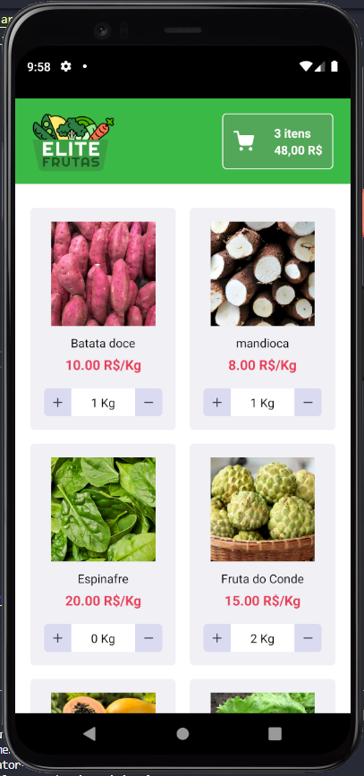
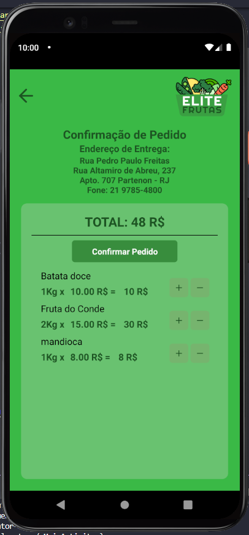

<h1 align="center">
    
    <br>Mobile Store<br/>
    | React Native |
</h1>

<p align="center">
  
  
  <br/>

</p>
<p align="center">
  <a href="#bookmark-sobre">Sobre</a>&nbsp;&nbsp;&nbsp;|&nbsp;&nbsp;&nbsp;
  <a href="#rocket-tecnologias">Tecnologias</a>&nbsp;&nbsp;&nbsp;|&nbsp;&nbsp;&nbsp;
  <a href="#boom-como-executar">Como Executar</a>&nbsp;&nbsp;&nbsp;|&nbsp;&nbsp;&nbsp;
  <a href="#memo-licença">Licença</a>
</p>

<p align="center">
  
  
<p>

## 🚀Sobre

Aplicação experimental para uma loja de Frutas e Hortaliças. 
Acessa uma API construida com node.js e já publicada na Digital Ocean.


## 🛠 Tecnologias

-  [Typescript](https://www.typescriptlang.org/)
-  [React Native](http://facebook.github.io/react-native/)
-  [axios](https://github.com/axios/axios)

## :boom: Como Executar

- ### **Pré-requisitos**

  - É **necessário** possuir o **[Node.js](https://nodejs.org/en/)** instalado no computador
  - É **necessário** possuir o **[Git](https://git-scm.com/)** instalado e configurado no computador
  - Também, é **preciso** ter um gerenciador de pacotes seja o **[NPM](https://www.npmjs.com/)** ou **[Yarn](https://yarnpkg.com/)**.

1. Faça um clone do repositório:

```sh
  $ git clone https://github.com/fabriciodorneles/efeira-mobile-store.git
```

2. Executando a Aplicação:

```sh
  $ cd mobile_store
  # Instalando as dependências do projeto.
  $ yarn # ou npm install
  # Inicie a aplicação mobile
  $ yarn android
```


